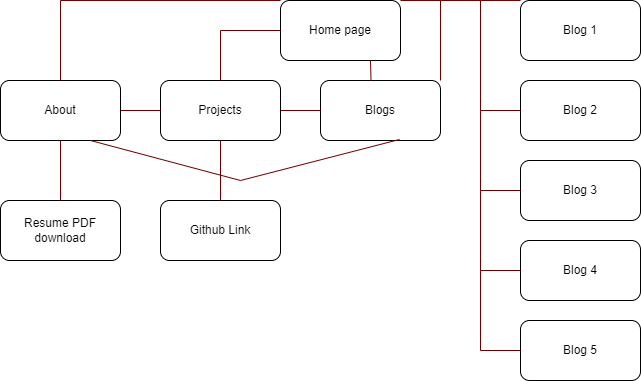

# Portfolio Documentation

## Purpose

Hi, this portfolio is my first attempt at fully constructing a connected website with my current knowledge. The content is based on me, as it is a portfolio, but I ended up using more placeholder content to fill in the blanks. Behind the scenes, it was more about practicing the html and CSS concepts I have learned over the recent weeks.

As a portfolio, the target audience would be potential employers/customers/team members who are looking for some one with website developing skills. I used only HTMl and CSS to design and structure my website.

## Sitemap

- Homepage is the front and also the index page
- Every page - outside the individual blogs - is connected through the navigation bar
- The logo/banner is also a link to the homepage
- 'About' page has a download link for a pdf with a mock-up resume
- 'Projects' page is currently empty due to a lack of content, but it does link to Github account site
- 'Blogs' page is more a table of blogs that link to their respective blog page
- Footer of each page also has icon links to my Github account and LinkedIn account
- I wanted every general page to be connected on each page, and if the user was curious about the blogs, they would go to the specific blog page

## Wireframe / Mock up / Screenshots

## Functionality, features and components

Banner: contains img and link elements to act like another homepage button. It is pinned to the top of the page, even when you scroll down the page on phones/tablets. When the home page has more content i.e. more updates posted, it would serve as a easy to click function to take the user to the home/index page.

Blog: contains headings, img and/or paragraph elements to house content. The blogs with img have a link to open up a more high quality version, if appicable. Its just a simple display for content, and the black and white alternating color scheme add contrast to draw in the user's eye. It can also house a smaller image to draw user's attention. 

Navigation Bar: contains links and spaced evenly with css grid. Sticky positioned to top of page, even when you scroll down the page on phones/tablets. Makes all the pages permanently in sight of the user to help with browsing the site.

Social: contains links and img elements. This is always at the end of the page. The icons are clickable links that take the user to my Github and LinkedIn if they want to see my work/work history. The links open into a different tab, so the user can still continue browsing the portfolio. Remains at bottom of the page no matter how long the content (more so for the mobile version). Just links user to more official sources of my work/work history.

## Github REPO
https://github.com/taijitsuhitsyou/FirstPortfolio